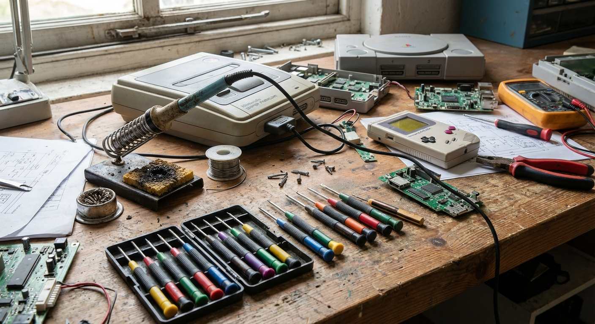
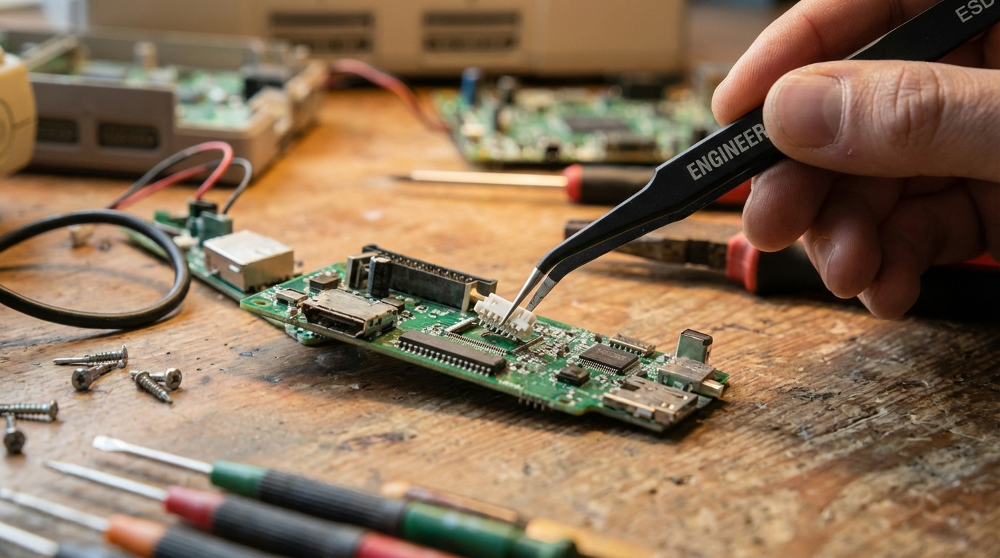
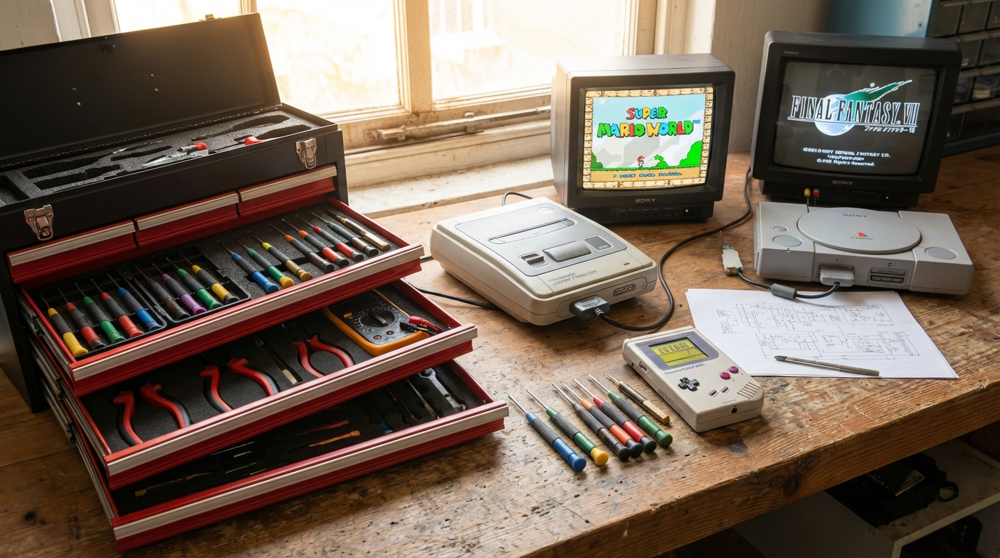

## ジャンク修理の世界へようこそ！

「ハードオフで安く買ったゲーム機が動かない」「フリマアプリで手に入れたPCを直したい」…そんな時に立ちはだかるのが**ツールの壁**です。

ジャンク修理は適切な道具さえあれば、成功率は劇的に上がります。今回は、手取り16万円からジャンク修理を趣味にしてきた筆者が、**「安くて、長く使えて、本当に役立つ」**具体的な定番工具を7つ厳選してご紹介します。

---

## 最初に揃えるべき基本工具7選

### 1. ベッセル(VESSEL) メガドラ  No.900 (+2)
まず最初に投資すべきは、信頼できるドライバーです。100均や中華工具セット等の安物ドライバーは先端が摩耗しやすく、**ネジの頭を潰してしまう原因**になります。

- **理由**: **「ジョーズフィット」**という加工がされており、ネジにガッチリ食いついて滑りません。
- **ポイント**: グリップが六角形状で滑りにくく、固着したネジでも驚くほど軽い力で回せます。



### 2. ベッセル(VESSEL) 精密ドライバーセット TD-56S
スマホやゲーム機の内部、ノートPCの分解に欠かせないのがこのセットです。精密小ねじは特に舐めやすく、万が一舐めた時にも部品入手が面倒なため、ドライバー先端の精度が極めて重要です。

- **理由**: TD-56Sは先端の精度が非常に高く、小さなネジもしっかり回せます。
- **ポイント**: グリップの末端が回転するので、手のひらで押し付けながら指先で回す「プロの回し方」が簡単にできます。

👉 [Amazonで価格を見る]()

### 3. KURE(呉工業) 接点復活スプレー
「ボタンの反応が悪い」「カセットを読み込まない」といった不具合の半分以上は、このスプレーだけで解決します。

- **理由**: 端子の酸化膜を除去し、通電をスムーズにします。
- **使い方**: 綿棒に少し染み込ませて、端子部分を優しく拭くだけ。ジャンク修理の「魔法の杖」です。

👉 [Amazonで価格を見る]()

### 4. エンジニア(ENGINEER) 非磁性ピンセット PT-17
電子基板の上の小さなチップ部品や、細い配線を掴むのに必須です。

- **理由**: このピンセットは**非磁性（磁石がつかない）**のため、電子部品を磁気で壊すリスクを最小限に抑えられます。
- **ポイント**: 先端の合わせが非常に精巧で、小さなネジもしっかり保持できます。

👉 [Amazonで価格を見る]()

### 5. 白光(HAKKO) 温度調節はんだごて FX-600
コンデンサの交換や断線の修理には必須です。

- **理由**: 安すぎるはんだごては熱くなりすぎて基板を傷めることがありますが、FX-600はダイヤルで温度を固定できるため安全です。
- **おすすめ**: 初心者こそ、**「道具のせいで失敗する」のを防ぐため**にこれを選んでください。

👉 [Amazonで価格を見る]()

### 6. エンジニア(ENGINEER) ハンダ吸取器 SS-03
古い部品を取り外す際、はんだをシュッと吸い取るためのポンプです。

- **理由**: このSS-03は、先端に**「耐熱シリコンノズル」**がついているのが最大の特徴。基板に密着させて吸い取れるので、初心者でも面白いくらいはんだが取れます。
- **補足**: 細かい隙間のはんだを取るために、**はんだ吸い取り線**も念のため持っておくと完璧です。

👉 [Amazonで価格を見る]()
👉 [Amazonで価格を見る]()

### 7. 三和電気計器(sanwa) デジタルマルチメータ PM3
「どこまで電気が来ているか」を調べるための診断機です。

- **理由**: 目に見えない電気の流れを確認することで、故障箇所を特定できます。
- **選び方**: sanwaのPM3はポケットサイズで場所を取らず、信頼性も抜群です。

👉 [Amazonで価格を見る]()

---

## 良い工具は「修理の成功率」を上げる

安物買いの銭失いという言葉がありますが、ジャンク修理においてそれは顕著です。粗悪な工具でネジを潰したり基板を焼いてしまうと、せっかくのジャンク品が**「直せたはずのゴミ」**になってしまいます。

最初は少し出費に感じるかもしれませんが、今回紹介した定番ブランドの道具は一度揃えれば数年、数十年と使い続けられます。

## まとめ

今回はジャンク修理に必須の基本工具7選を具体名で解説しました。

- **分解用**：ベッセルNo.900、TD-56S
- **清掃・診断用**：KUREの接点復活剤、三和PM3
- **はんだ作業用**：白光FX-600、エンジニアSS-03、エンジニアPT-17

ジャンク修理は、自分の手でモノを蘇らせる最高の快感があります。手取りが少なくても、少しずつ道具を揃えていけば、趣味を楽しみながら節約生活を送ることも可能です。

ぜひ、お近くのハードオフで気になるジャンク品を探すところから始めてみてください！

---